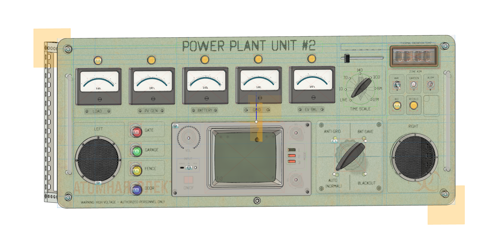
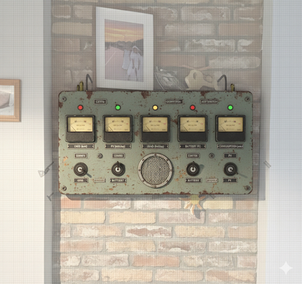
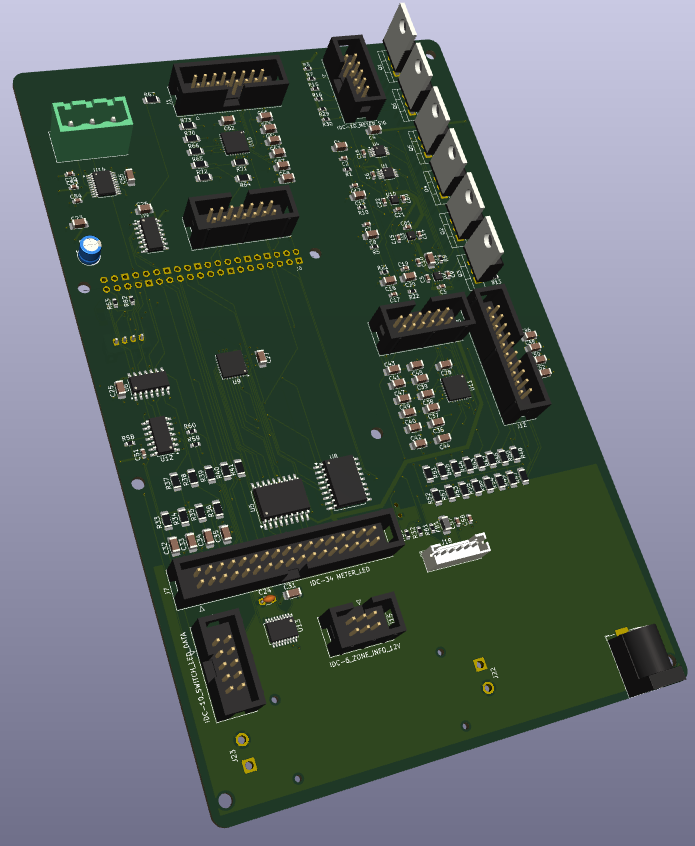
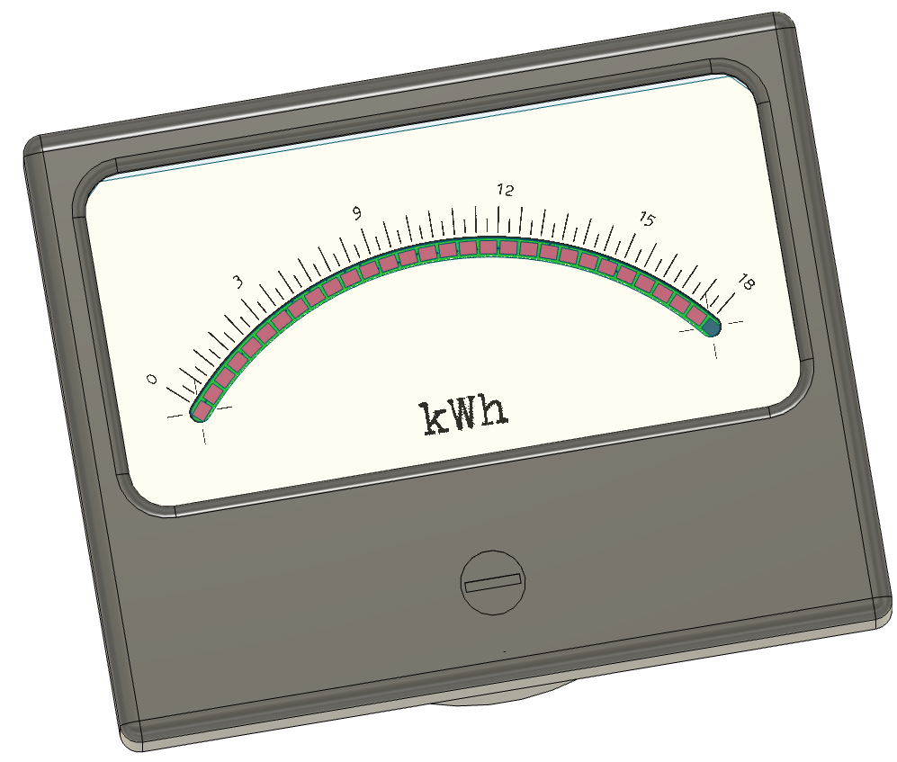
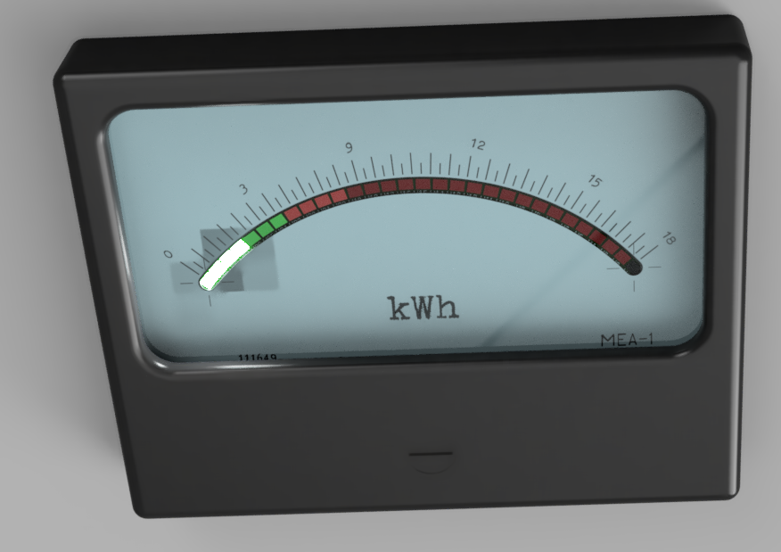
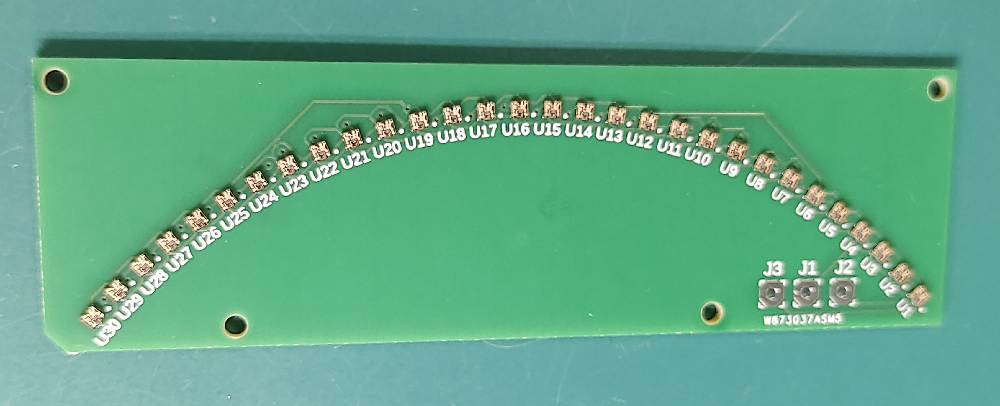

# POWERPANEL

_Opis funkcjonalny systemu — retro‑analogowy interfejs do Home Assistanta._

 

  
  
  

_Kliknij, aby powiększyć. Wymiary panelu: 108 × 44 cm._ 

### Spis treści
- [1. Cel i koncepcja projektu](#1-cel-i-koncepcja-projektu)
- [2. Architektura i główne sekcje panelu](#2-architektura-i-główne-sekcje-panelu)
  - [2.1 Płyta główna (Main Board)](#21-płyta-główna-main-board)
  - [2.2 Moduły zewnętrzne](#22-moduły-zewnętrzne)
- [3. Mechanika i interfejs użytkownika](#3-mechanika-i-interfejs-użytkownika)
  - [3.1 Mierniki (sekcja)](#31-mierniki-sekcja)
- [4. Bloki funkcjonalne](#4-bloki-funkcjonalne)
  - [4.1 BLK_METER_ANALOG](#41-blk_meter_analog)
  - [4.2 BLK_METER_LED](#42-blk_meter_led)
  - [4.3 BLK_SWITCHES](#43-blk_switches)
  - [4.4 BLK_CONSOLE](#44-blk_console)
  - [4.5 BLK_SWITCH_LED](#45-blk_switch_led)
- [5. Komunikacja i zasilanie](#5-komunikacja-i-zasilanie)
- [6. Mechanika i ergonomia](#6-mechanika-i-ergonomia)
- [7. Uwagi konstrukcyjne](#7-uwagi-konstrukcyjne)
- [8. Podsumowanie](#8-podsumowanie)
- [9. Pliki schematów i PCB](#9-pliki-schematów-i-pcb)

---

## 1. Cel i koncepcja projektu
PowerPanel to fizyczna interpretacja możliwości systemu Home Assistant — 
czyli materialny, retro-analogowy interfejs do cyfrowego świata automatyki domowej.  

Nie jest to tylko panel energetyczny, ale wielosekcyjny moduł kontrolny i wizualizacyjny,
który odwzorowuje najważniejsze funkcje systemu HA w postaci fizycznych mierników, przycisków, 
przełączników, enkoderów i wskaźników świetlnych.

Celem jest uzyskanie wrażenia „żywego pulpitu sterowniczego” — 
panelu, który reaguje w czasie rzeczywistym na dane z Home Assistanta: energię, temperatury, stany stref, 
tryby pracy, alarmy, a także pozwala na bezpośrednią interakcję z systemem przez dotyk, pokrętła i przełączniki.

Całość utrzymana w stylistyce retro-industrialnej: 
mierniki URAL, bakelitowe przełączniki krzywkowe, suwakowe selektory, 
oraz matowy ekran LCD w stylu terminalowym, wpisujący się w analogowy klimat.

## 2. Architektura i główne sekcje panelu
System składa się z jednej płyty głównej (Main Board) i zestawu płytek peryferyjnych połączonych taśmami IDC.

### 2.1 Płyta główna (Main Board)
Zawiera wszystkie układy logiczne, analogowe i interfejsowe:
- ekspandery MCP23017 (wejścia, przyciski, enkodery),
- przetwornik DAC MCP4728 (sterowanie wskazówkami),
- bufory 74AHCT125 (3.3V → 5V dla WS2812),
- sterowniki ULN2803A (lampki i podświetlenia 12V),
- wzmacniacze LM358 (sterowniki prądowe wskaźników),
- złącza IDC dla modułów zewnętrznych.

  

_Wizualizacja 3D płyty głównej (KiCad)._ 

Serce systemu stanowi Raspberry Pi 5, zamontowane bezpośrednio na płycie głównej (formą zbliżone do HAT), zapewniając komunikację, logikę i integrację z Home Assistantem.

Zasilanie:
- 12 V – sekcja mocy i lampek,
- 5 V – LED i DAC,
- 3.3 V – logika i magistrala I²C.
Masę podzielono na GND i GNDPWR (łączone w jednym punkcie).

### 2.2 Moduły zewnętrzne
- **NIXIE BOARD** – sterowanie lampami IN-14 (SPI, wysokonapięciowe).
- **METER PANEL** – z miernikami URAL i podświetleniem LED WS2812.
- **SWITCH PANEL** – sekcja przełączników trybów i zakresów czasowych.
- **CONSOLE PANEL** – centralny moduł z retro-ekranem LCD, enkoderami i kontrolkami.
- **ZONE ADM PANEL** – sekcja administracyjna stref (WAY / GARDEN / ALARM / OPEN).
- **INFO LED BOARD** – lampki 12 V (BIO, REC, OPEN, statusy).

Każdy moduł łączy się z płytą główną przez złącza IDC (10–34 pin).

## 3. Mechanika i interfejs użytkownika
Panel został podzielony na kilka stref funkcjonalnych, rozmieszczonych ergonomicznie na froncie obudowy:

- **Sekcja mierników (górna)** – pięć wskaźników URAL, 
  każdy z osobnym kanałem DAC i LED-podświetleniem.  
  Powyżej nich znajduje się przełącznik krzywkowy pozwalający zmieniać **skalę czasu** (LIVE / 1D / 7D / 14D / 1M / 6M / 12M).

- **Sekcja ZONE ADM (lewa dolna)** – przyciski i lampki strefowe, 
  np. WAY, GARDEN, ALARM, OPEN_PLACE.  
  Każda lampka 12 V jest sterowana z ULN2803A, a przycisk raportuje stan do HA przez I²C.

- **Centralna sekcja sterowania** – retro ekran LCD (terminalowy, tekstowy) 
  pokazujący status systemu i parametry; obok pokrętło **głośności (ENC_VOL)** z ring-LED, 
  przyciski **MODE_A/B/C** (zmiana trybu HA), oraz **przełącznik INPUT/OUTPUT**.

- **Sekcja energetyczna (prawa dolna)** – przełącznik krzywkowy głównego obiegu energetycznego (np. GRID / BAT / ISLAND),
  kontrolki statusu ładowania, oraz wskaźnik prądu zasilania głównego.

- **Selektor temperatury (prawy górny)** – przełącznik suwakowy wybierający, 
  które pomieszczenie ma być aktualnie wskazywane na mierniku temperatury (OUTDOOR / SALON / GAB / MIB / HEL / OLA).

Każdy element panelu ma fizyczne sprzężenie zwrotne: ruch wskazówki, światło LED, dźwięk enkodera, klik przełącznika.  
To czyni PowerPanel prawdziwie materialnym interfejsem Home Assistanta.

### 3.1 Mierniki (sekcja)

  
  
  
  

_Tarcza, render sekcji i płytka z 30 micro‑LED — kliknij, aby powiększyć._

Na schemacie wyjścia prowadzące do poszczególnych mierników oznaczone są ich pierwotnymi parametrami (np. „2A”, „25mA”). Oznaczenia te służą pamięci i kalibracji podczas strojenia układu.

Każdy miernik, poza podstawowym działaniem pomiarowym, został zmodyfikowany:
- pod główną skalą umieszczono 30 programowalnych micro‑LEDów, pozwalających tworzyć efekty świetlne i subtelne wskazania kontekstowe,
- dodatkowy LED podświetla tarczę, poprawiając czytelność w słabym oświetleniu.

## 4. Bloki funkcjonalne

### 4.1 BLK_METER_ANALOG
Sterowanie pięcioma miernikami URAL.  
Układy: MCP4728 + LM358 + tranzystory 2N2222A.  
Każdy kanał DAC generuje napięcie (0–5 V) → LM358 → tranzystor NPN → cewka miernika.  
Filtry RC (100 nF + 10 kΩ) wygładzają wskazanie.  
Zasilanie 5 V, masa GNDPWR.  
Kanały: SENSE_A–E (MTR1–MTR5).

---

### 4.2 BLK_METER_LED
Sterowanie LED WS2812 i przyciskami 12 V w sekcji mierników i przycisków.  
Układy: MCP23017, ULN2803A ×2, 74AHCT125 ×2.  
Port A MCP23017 steruje ULN2803A (OUT_Mx_BL, URAL).  
Port B obsługuje przyciski i kontrolki (BTN_GATE, GARAGE, DOOR itd.).  
Bufory 74AHCT125 translatują sygnały LED 3.3V → 5V (MTR1–MTR5).  
Rezystory 68 Ω w szereg z liniami danych.  
Lampki 12 V sterowane z ULN2803A (open collector).  
GND i GNDPWR łączone w jednym punkcie.

---

### 4.3 BLK_SWITCHES
Sekcja 12 przełączników (tryby + zakresy) i 4 przyciski ZONE ADM.  
Układ: MCP23017 @ 0x21.  
Wejścia z pull-up 10 kΩ, C=100 nF do GND (debounce).  
Złącza:  
- IDC-20_SWITCH_BUS – tryby pracy (AUTO, BAT-SAVE, BLACKOUT, itp.)  
- IDC-12_SWITCH_ZONE_BUS – strefy (WAY, GARDEN, ALARM, OPEN)  
Stany czytane przez I²C.

---

### 4.4 BLK_CONSOLE
Centralny panel z trzema enkoderami i przyciskami MODE.  
Układ: MCP23017 @ 0x23.  
Pull-up 10 kΩ + C=100 nF (debounce).  
Linia INT_CONSOLED (opcjonalne przerwanie).  
Złącze IDC-16_CONSOLE:  
- MODE_A/B/C – wybór trybów  
- ENC_VOL, ENC_TOP, ENC_BOTTOM – enkodery  
- VOL_RING_DATA – dane LED pierścienia  
- przyciski push – w osi enkoderów

---

### 4.5 BLK_SWITCH_LED
Buforowanie danych LED (74AHCT125) i sterowanie lampkami 12 V (ULN2803A).  
Złącza:  
- IDC-10_SWITCH_LED_DATA – LED WS2812  
- IDC-6_ZONE_INFO_12V – lampki BIO / REC / OPEN  
Sygnały 3.3V z RPi → bufory 5V → taśmy WS2812.  
Rezystory R58–R60 = 100 Ω.  
Wspólna masa GND↔GNDPWR.

---

## 5. Komunikacja i zasilanie
Magistrala I²C:
- MCP23017 (SWITCHES) – 0x21  
- MCP23017 (CONSOLE) – 0x23  
- MCP23017 (METER_LED) – 0x20  
- MCP4728 (METER_ANALOG) – 0x60  

Zasilanie:
- +12 V – lampki i przekaźniki  
- +5 V – LED WS2812, DAC  
- +3.3 V – logika i I²C  
- GND / GNDPWR – wspólny punkt (separacja prądów)

---

## 6. Mechanika i ergonomia
- Wskaźniki URAL – analogowe sprzężenie ruchu z DAC.  
- LED – efekt tła i animacje w rytmie danych HA.  
- Przyciski 12 V – kontrola stref / trybów.  
- Enkodery – głośność, tryby, ustawienia.  
- Krzywkowe i suwakowe selektory – wybór skali czasu, temperatury, źródła energii.  
- Retro LCD – dane systemowe i statusy HA.  

- Panel frontowy z blachy stalowej zostanie poddany kontrolowanemu procesowi postarzenia (patyna, przetarcia, delikatnie pordzewiałe krawędzie), aby uzyskać wygląd starego, przemysłowego urządzenia.

Każdy element ma bezpośrednią funkcję w HA i wizualne potwierdzenie akcji.

---

## 7. Uwagi konstrukcyjne
- Separacja GND / GNDPWR.  
- Stitching vias między planami mas.  
- 100 nF przy każdym układzie.  
- Rezystory szeregowe 68–100 Ω przy WS2812.  
- C = 1000 µF przy zasilaniu LED.  
- LM358 i MCP4728 zasilane z 5 V (z odniesieniem do GNDPWR).  
- Bufory 74AHCT125 – VCC = 5 V, Vih ≥ 2 V.

---

## 8. Podsumowanie
PowerPanel to fizyczny interfejs Home Assistanta — 
łączący dane z automatyki, energii, stref, mediów i systemów bezpieczeństwa w jednym, dotykalnym pulpicie.

Zawiera:
- 5 analogowych mierników URAL (DAC-sterowane),
- 3 enkodery + ring LED,
- 20+ LED WS2812,
- 20 przycisków i przełączników,
- kontrolki 12 V,
- wyświetlacz LCD retro,
- oraz krzywkowe i suwakowe selektory trybów.

Stanowi pomost między cyfrowym systemem automatyki a fizycznym światem.

---

## 9. Pliki schematów i PCB

Pliki KiCad znajdują się w katalogu `hardware/pcb`:

- Główne pliki projektu: `hardware/pcb/powerplant.kicad_sch`, `hardware/pcb/powerplant.kicad_pcb`
- Schematy bloków: 
  - `hardware/pcb/BLK_BUTTONS.kicad_sch`
  - `hardware/pcb/BLK_CONSOLE.kicad_sch`
  - `hardware/pcb/BLK_METER_LED.kicad_sch`
  - `hardware/pcb/BLK_SWITCH_LED.kicad_sch`
  - `hardware/pcb/BLK_SWITCHES.kicad_sch`

Pełne drzewo plików sprzętowych: `hardware/pcb/`.